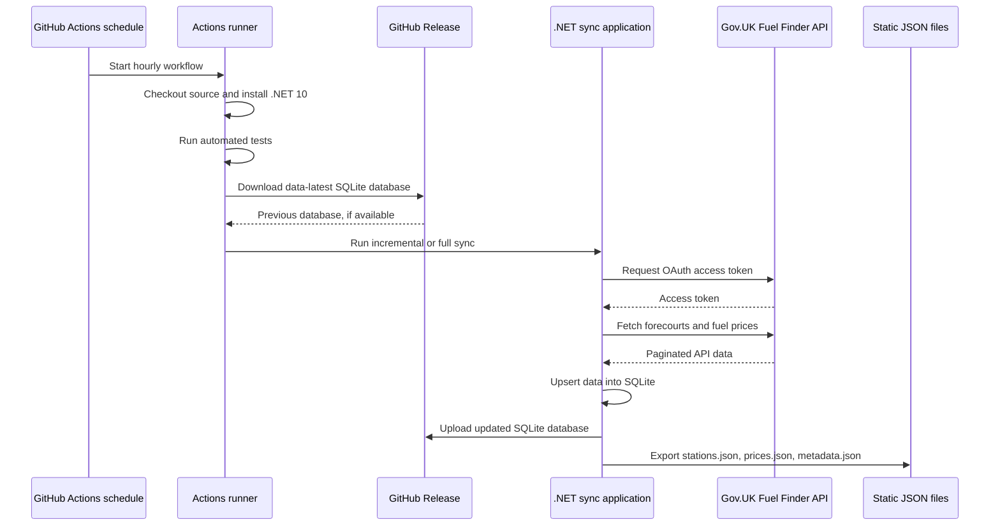
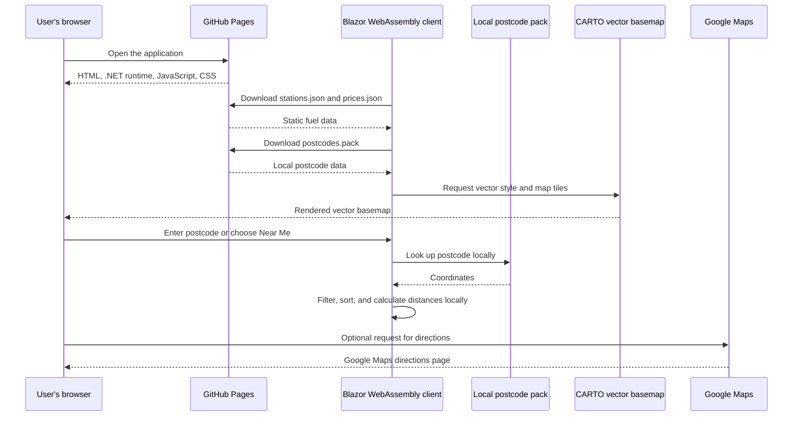

# Pence Per Litre

Pence Per Litre is a static web application for finding current UK forecourt fuel prices near a postcode or the user's device location. It combines forecourt metadata and fuel prices from the Gov.UK Fuel Finder service with a local postcode lookup database. Search, filtering, distance calculations, and sorting run in the browser.

Live site: [ppl.liampeters.co.uk](https://ppl.liampeters.co.uk/)

## What It Does

- Loads UK forecourt metadata and fuel prices into a local SQLite database during a scheduled data sync.
- Publishes compact station and price JSON files as part of the web application.
- Searches the published data on the device by postcode, distance, fuel type, supermarket status, opening hours, and price.
- Shows stations on a CARTO vector basemap using MapLibre GL JS.
- Supports browser geolocation when the user chooses **Near Me**.
- Works as a Blazor WebAssembly progressive web app, with published static assets and selected data available for offline use.

Fuel reports can be missing, delayed, or out of date. The application displays the update time supplied with each price where it is available. It does not guarantee that a price is still available at the forecourt.

## Architecture

### Data fetch

The data-fetching process runs in GitHub Actions. The workflow is scheduled hourly at 17 minutes past the hour in UTC, and can also be started manually or by a push to `main`. GitHub Actions schedules are not guaranteed to start at the exact minute requested.

The workflow restores the previous SQLite database from the `data-latest` GitHub Release when one exists. The .NET sync application then uses the Gov.UK Fuel Finder API for incremental updates, or performs a full sync when required. It writes the updated database back to the release and exports the client-facing JSON files.



The sync uses incremental API requests where possible. A Fuel Finder response saying that a requested batch is not available is treated as an empty incremental result, so a quiet period does not fail the workflow. Other API errors remain failures.

### Data serving

The client is published as static files to GitHub Pages. There is no application server or per-user API in this project. On startup, the Blazor WebAssembly client downloads the published station and price JSON files, then keeps them in browser memory for local search. The postcode pack is also downloaded once and searched locally.

The map itself requests CARTO vector styles and tiles from the browser. When the user requests directions, the application opens Google Maps in a new tab. These services are separate from the application's static data serving.



## Privacy

The application is designed not to track people.

- There is no user account, analytics service, advertising SDK, application telemetry, or application database of searches or locations.
- Postcode lookup, distance calculation, filtering, and sorting take place in the browser.
- A postcode entered into the search box is not sent to an application server.
- Browser geolocation is requested only after the user chooses **Near Me**. The coordinates are used locally to search and centre the map; they are not sent to the application's backend because there is no backend for this purpose.
- The published data contains forecourt and price information, not user information.

Normal web-service considerations still apply. Requests for static files go to GitHub Pages, map style and tile requests go to CARTO, and an optional directions request goes to Google Maps. Those providers may process request metadata such as an IP address under their own privacy policies. OpenStreetMap data is used by the basemap provider and is credited on the map. The application does not control those providers' logging or retention practices.

## Requirements

### Running the client locally

- Windows, macOS, or Linux.
- The .NET 10 SDK.
- The Tailwind CSS standalone CLI available as `tailwindcss` on `PATH`. Node.js and NPM are not required locally. The project invokes the standalone CLI during the client build.
- A CARTO API key is recommended for local and deployed map use. The local `wwwroot/config.js` contains an empty placeholder; the map may be limited without a key.

To build and test the solution:

```text
dotnet restore
dotnet test PencePerLitre.slnx --configuration Release
dotnet build src/PencePerLitre.Client/PencePerLitre.Client.csproj --configuration Release
```

To run the client locally:

```text
dotnet run --project src/PencePerLitre.Client/PencePerLitre.Client.csproj
```

The client reads the static data already present in `src/PencePerLitre.Client/wwwroot/data`. Running the client does not fetch fresh Gov.UK data.

### Running the data sync

To fetch or export data locally, you also need:

- A Gov.UK One Login account and access to the Fuel Finder API. Follow the official guidance: [Access the latest fuel prices and forecourt data via API or email](https://www.gov.uk/guidance/access-the-latest-fuel-prices-and-forecourt-data-via-api-or-email).
- Fuel Finder API credentials, normally supplied as `FUEL_FINDER_CLIENT_ID` and `FUEL_FINDER_CLIENT_SECRET`.
- Optional `FUEL_FINDER_BASE_URL` and `FUEL_FINDER_PROXY_KEY` values if your API access requires them.
- A writable location for the SQLite database and exported files.

The sync application supports a `.env` file in the repository root for local development. Do not commit credentials. A minimal local setup looks like this, with real values supplied locally:

```text
FUEL_FINDER_CLIENT_ID=your-client-id
FUEL_FINDER_CLIENT_SECRET=your-client-secret
FUEL_FINDER_BASE_URL=https://www.fuel-finder.service.gov.uk
FUEL_FINDER_PROXY_KEY=your-proxy-key-if-required
```

Run a normal sync with:

```text
dotnet run --project src/PencePerLitre.Sync/PencePerLitre.Sync.csproj -- --output src/PencePerLitre.Client/wwwroot/data
```

Useful options include:

- `--full`: perform full forecourt and fuel-price syncs.
- `--prices-only`: skip forecourt metadata sync.
- `--pfs-only`: skip fuel-price sync.
- `--export-only`: export the current SQLite database without calling the Fuel Finder API.
- `--db <path>`: use a specific SQLite database path.
- `--output <directory>`: select the JSON output directory.

### GitHub Actions deployment

The workflow needs these GitHub secrets:

- `FUEL_FINDER_CLIENT_ID`
- `FUEL_FINDER_CLIENT_SECRET`
- `FUEL_FINDER_BASE_URL`, if required by the API setup
- `FUEL_FINDER_PROXY_KEY`, if required by the API setup
- `CARTO_API_KEY`

The workflow runner already provides the command-line tools used by the workflow, including Node.js for a small configuration-file generation step. Node.js and NPM are not requirements for local development of the application.

## Project Layout

- `src/PencePerLitre.Client`: Blazor WebAssembly client, static assets, map integration, and local data services.
- `src/PencePerLitre.Shared`: DTOs, JSON configuration, geographic calculations, and the compressed postcode lookup engine.
- `src/PencePerLitre.Sync`: Gov.UK API client, SQLite persistence, incremental sync logic, and JSON export.
- `src/PencePerLitre.Tests`: xUnit tests for the client services, sync behaviour, database export, and postcode lookup.
- `.github/workflows/sync-and-deploy.yml`: test, sync, publish, and GitHub Pages deployment workflow.

## External Services And Libraries

- [Gov.UK Fuel Finder service](https://www.gov.uk/guidance/access-the-latest-fuel-prices-and-forecourt-data-via-api-or-email): source of forecourt metadata and fuel prices.
- [CARTO](https://carto.com/): vector basemap styles and tiles. See the [CARTO basemaps documentation](https://docs.carto.com/faqs/carto-basemaps).
- [MapLibre GL JS](https://maplibre.org/): open-source WebGL map renderer used by the current client.
- [OpenStreetMap](https://www.openstreetmap.org/): source data credited by the CARTO basemap.
- [NearMyPostcode](https://codeberg.org/lexbailey/nearmypostcode/): privacy-focused front-end JavaScript postcode lookup project by [Lex Bailey](https://codeberg.org/lexbailey). This project uses its approach and postcode pack format for local, browser-based postcode lookup.
- [Leaflet](https://leafletjs.com/): the project previously used Leaflet for raster maps. The current vector-map implementation uses MapLibre GL JS instead.
- [GitHub Actions](https://github.com/features/actions): scheduled data-fetch and deployment automation.
- [GitHub Pages](https://pages.github.com/): static hosting for the published client.
- [Microsoft .NET](https://dotnet.microsoft.com/): runtime, Blazor WebAssembly, and build tooling.
- [SQLite](https://www.sqlite.org/): local sync database, accessed through [Microsoft.Data.Sqlite](https://learn.microsoft.com/dotnet/standard/data/sqlite/).
- [Tailwind CSS](https://tailwindcss.com/): utility CSS generation using its standalone CLI.
- [Google Maps directions](https://www.google.com/maps): optional external directions link opened by the user.

The local postcode lookup is based on [NearMyPostcode](https://codeberg.org/lexbailey/nearmypostcode/), by [Lex Bailey](https://codeberg.org/lexbailey) (they/them), a privacy-focused front-end JavaScript library for converting UK postcodes to approximate coordinates. This repository includes a bundled postcode dataset ([postcodes.pack](src/PencePerLitre.Client/wwwroot/postcodes.pack)) and a C# lookup implementation ([PostcodeLookupEngine.cs](src/PencePerLitre.Shared/PostcodeLookupEngine.cs)) adapted for the Blazor client. The pack is searched locally; it is not a live postcode API. NearMyPostcode documents the [ONS postcode database](https://www.ons.gov.uk/methodology/geography/licences) as its data source, and the source and distribution terms of any third-party postcode data should be checked before redistributing it independently.

## Contributing

1. Create a fork or branch from `main`.
2. Make a focused change and add or update tests where behaviour changes.
3. Run the solution tests and a relevant build locally:

   ```text
   dotnet test PencePerLitre.slnx --configuration Release
   dotnet build src/PencePerLitre.Client/PencePerLitre.Client.csproj --configuration Release
   ```

4. Do not commit API credentials, `.env` files, SQLite database files, generated minified CSS, or other local build output.
5. Update this README when setup, external services, privacy behaviour, or deployment changes.
6. Open a pull request with a short description of the change and any limitations or data-provider assumptions.

Please keep contributions compatible with the existing .NET 10 solution and preserve the required CARTO and OpenStreetMap attribution.

## Data And Operational Notes

- The public site is a static snapshot generated by the latest successful deployment.
- GitHub Actions scheduled jobs can be delayed or skipped by GitHub. The workflow also supports manual dispatch.
- The SQLite database is persisted in the `data-latest` GitHub Release so incremental runs can continue from the previous state.
- A missing incremental Fuel Finder batch is treated as no changes. Other API failures stop the workflow so stale or partial data is not silently published.
- The client uses a service worker in published builds. Browser caches can mean that an existing visitor does not see a newly published dataset immediately.
- API keys and API access are subject to the terms, quotas, and fair-use limits of their providers.

## Licence

The project source code is released under the [MIT License](LICENSE). Third-party libraries, map data, basemap services, postcode data, and government data may have separate licences or terms. Their required notices and attribution continue to apply.
